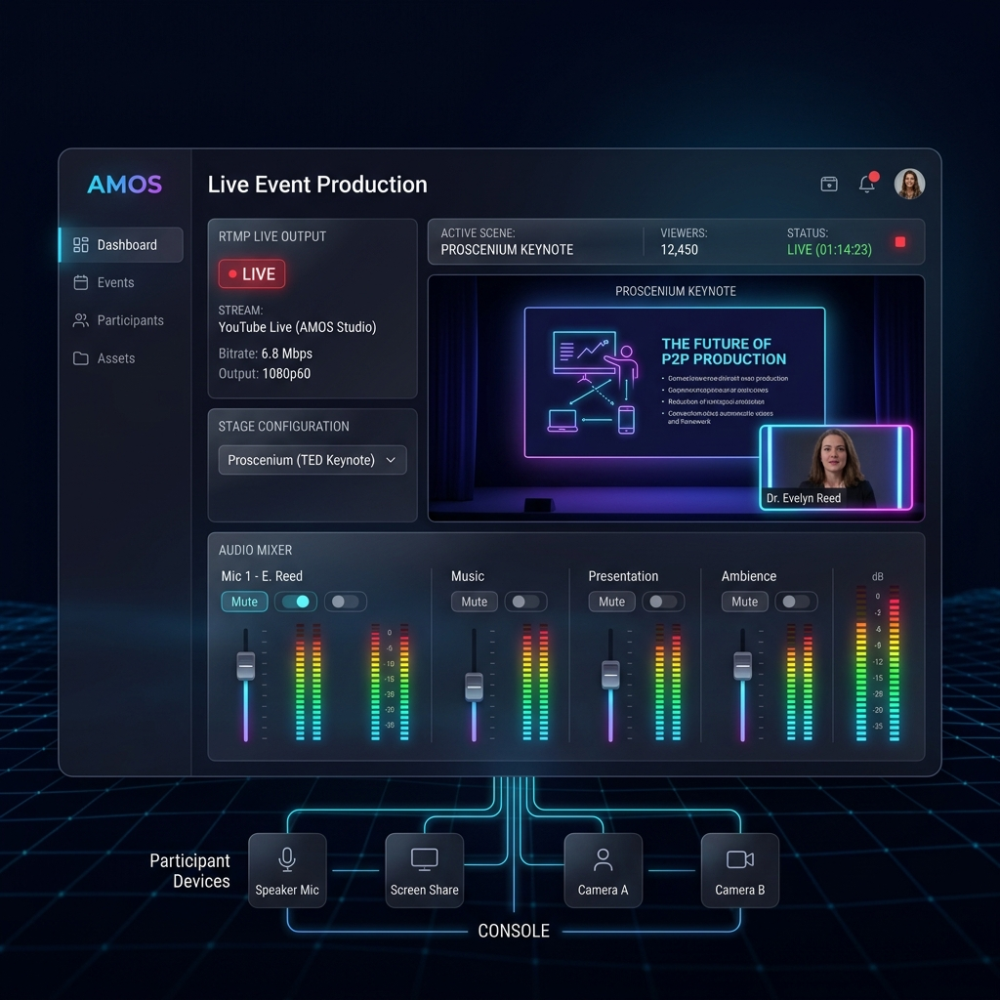
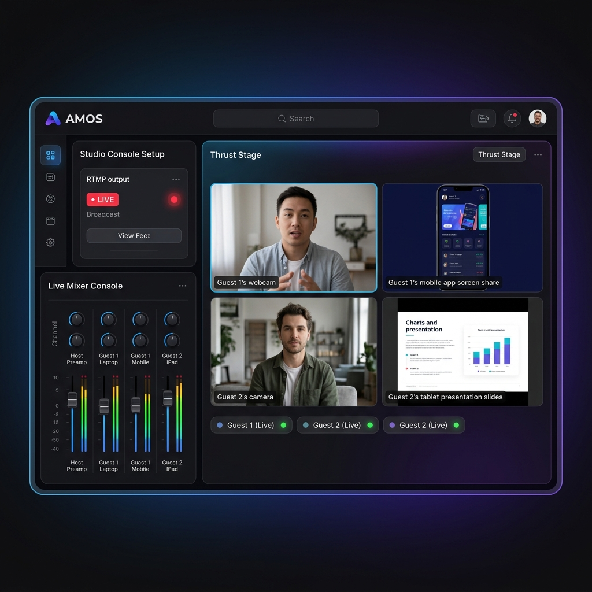
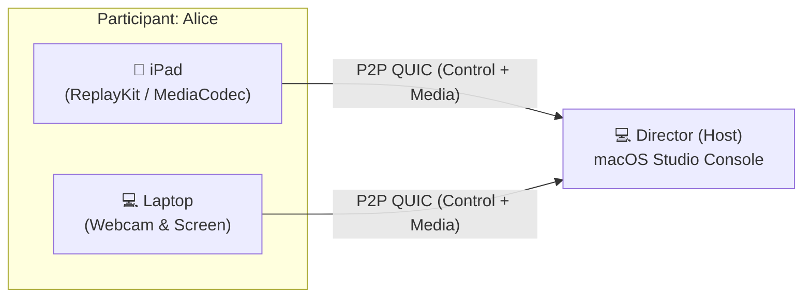
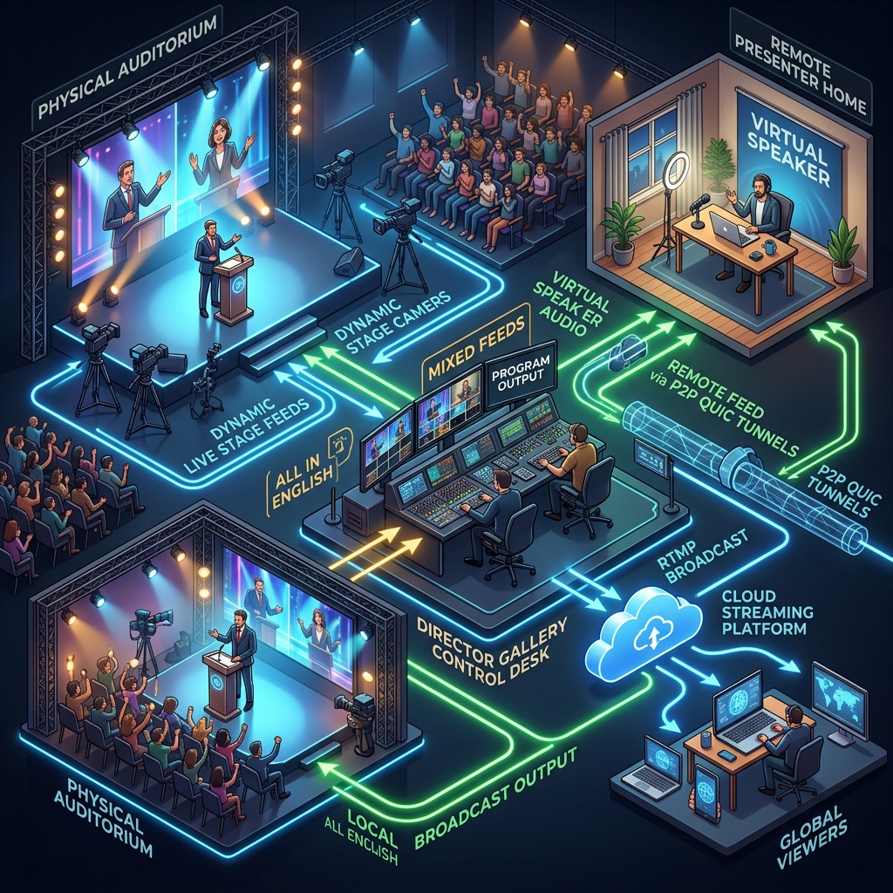
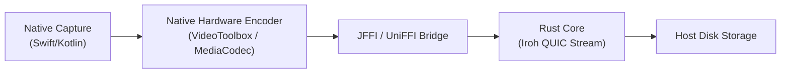

# AMOS (Add More On Stage) 🎬

> **Traditional video conferencing:** One participant, one device. (2010 paradigm)
> 
> **AMOS:** Add More On Stage. Bring every device, stay one participant.

| Proscenium Layout (Single Keynote) | Thrust Layout (Multi-Device Panel) |
| :---: | :---: |
|  |  |

AMOS is a decentralized, local-first, multi-device event production studio built with the **JFFI** framework (Rust + UniFFI + native platform UI) and powered by **Iroh**'s peer-to-peer networking stack. 

Operating like a **real-world broadcast studio control room**, AMOS decouples physical cameras, microphones, screenshares, and slides into independent input channels, routing them dynamically over a peer-to-peer matrix. It is designed to host and record live events ranging from simple one-on-one meetings to massive, TED-level online conferences. By treating multiple physical devices as inputs for a single participant identity, presenters can link up multiple live feeds (laptop screens, secondary cameras, tablets, and webcams) simultaneously without cloud compression bottlenecks, acoustic feedback/echo loops, or multiple meeting logins.

---

## 💡 The Core Vision

Standard web conferencing tools (Google Meet, Zoom, Teams) treat each device connection as a separate person. In high-end online events, presenters need to share close-ups, screens, and cameras simultaneously. 
1. **Device Friction:** Users must log in multiple times, cluttering the video grid and triggering howling acoustic feedback loops.
2. **Cloud Compression:** High-bitrate video feeds are crushed to fit low-bandwidth real-time streams, blurring slides and product presentations.
3. **Flat Output:** You get a single compiled low-resolution stream instead of isolated, edit-ready, broadcast-quality tracks.

AMOS solves this by mapping the physical world of stage production directly onto a virtual, decentralized event console.

---

## ⚡ The AMOS Solution

AMOS leverages direct peer-to-peer QUIC tunnels to stream high-definition, hardware-encoded media tracks directly from guests' linked devices to the director's local storage, completely bypassing the cloud.



### Hybrid Studio Capture & Routing Architecture (In-House & Remote Combined)


* **Single Identity, Multiple Feeds:** Custom metadata binds multiple linked devices to a single human participant on stage.
* **Theatrical Stage Layouts:** Choose your audience-to-stage arrangement directly in the console:
  * **Proscenium (TED Keynote)**: Traditional setup where all eyes face forward, optimizing screen real estate for a keynote presenter or screenshare.
  * **Thrust (Panel Discussion)**: The stage protrudes outward. The audience surrounds on three sides, creating the ideal setup for panel discussions.
  * **In the Round (Arena Huddle)**: Circular roundtable where the audience completely surrounds the stage (perfect for small, informal huddles).
  * **Traverse (Runway Showcase)**: Runway style where the audience sits on two opposing sides (perfect for side-by-side showcases).
  * **Black Box Studio (Custom)**: A fully flexible, reconfigurable room designed for custom multi-device routing.
* **Live Broadcast Mixer Console**: Independent fader channel strips for the host mic preamp and all guest feeds to mix levels in real-time.
* **RTMP Live Output**: Routable live output allowing streaming directly to YouTube Live or Twitch with built-in LIVE status telemetry.
* **Studio Soundboard**: A native sound-stinger pad (👏 Applause, 🔔 Buzzer, 💨 Whoosh) to inject interactive audio effects during live productions.
* **Hardware Accelerated**: Capture and encoding are offloaded to native OS hardware chips (Apple `VideoToolbox`/`AVAssetWriter` on iOS/macOS, `MediaCodec`/`MediaProjection` on Android) for 0% CPU strain.
* **Sync-Ready Outputs**: The host app saves isolated `.mp4` / `.aac` streams organized by participant folder, ready for editing.

---

## 🏗️ Architecture

AMOS uses a clean separation of concerns between native OS capabilities and Rust transport logic:



### 1. Native Platform UI Layer (`platforms/`)
* Handles platform-specific UI and permissions.
* Implements screen and audio capture using native APIs (`ReplayKit` on iOS, `MediaProjection` on Android).
* Runs native H.264/HEVC hardware encoding and passes the compressed byte packets down to the Rust core.

### 2. Rust Core Layer (`core/`)
Powered by the **Knot Protocol** (`knot-protocol` crate), the Rust core acts as the transport and orchestration coordinator for AMOS. 

#### Why AMOS uses Knot Protocol:
In professional event production, a single presenter (e.g., "Alice") often wants to use multiple devices simultaneously (laptop webcam, overhead camera, tablet screenshare). 
* **The Problem:** Raw P2P networking treating them as individual nodes would split Alice into three separate participants on the screen layout grid, requiring separate meeting logins and risking acoustic echo howling loops.
* **The Knot Solution:** Knot Protocol decouples physical connection endpoints (**Ropes**) from the logical participant identity (**the Knot**). Alice registers all three devices (Ropes) under her unified participant ID (`knot_id: "alice"`). The director's console treats them as a single logical presenter with multiple routable media feeds.

#### How AMOS integrates Knot Protocol:
* **The Host (Director)**: Spawns `KnotHub` to orchestrate incoming peer connections. It listens to the `UnboundedReceiver<HubEvent>` channel for connection events, stream configurations, and incoming media frames, routing them directly to the native macOS/iOS UI layer.
* **The Clients (Guest Devices)**: Bootstrapped via `KnotClientBuilder` using connection tickets. They register under the unified participant `knot_id`, configure unidirectional media streams (e.g., camera, microphone, screen share), and transmit encoded binary frames directly P2P.
* **Media Storage**: High-bitrate media frames are saved directly to host disk storage using Knot's structured database recording mechanism.

## ⚡ Low-Latency Media Optimizations

AMOS applies industry-standard capture and compression optimization patterns from Apple Developer guidelines, WebRTC, and [OBS Studio](https://github.com/obsproject/obs-studio) to maintain extremely low latency and bandwidth usage over peer-to-peer QUIC connections:

### 🖥️ Screensharing (ScreenCaptureKit & ReplayKit)
* **App Exclusions (Anti-Mirroring)**: Excludes the AMOS application window from capture by filtering using the unique Process ID (PID), eliminating infinite recursive feedback loops.
* **Native YUV planar composition**: Requests bi-planar NV12 YUV (`kCVPixelFormatType_420YpCbCr8BiPlanarVideoRange`) directly from ScreenCaptureKit, eliminating GPU-to-CPU BGRA-to-YUV color conversion overhead.
* **Compositor Queue Depth Tuning**: Caps the frame compositor queue depth to `2` to minimize system display buffering delay.
* **Frame Rate Throttling**: Limits capture at the OS level to a flat 30fps to avoid overloading encoders and network sockets with high refresh rate displays (e.g. 120Hz ProMotion).
* **Incomplete & Idle Frame Dropping**: Parses the metadata attachments for `SCStreamFrameInfo.status` and drops non-complete (e.g. idle or blank) frames, saving CPU and bandwidth when the screen is static.
* **Display Disconnection Fallback**: Listens for stream failures and automatically fallbacks to the primary built-in display (`CGMainDisplayID()`) if an external monitor is unplugged.

### 🎥 Camera Video (AVFoundation)
* **Cadence Frame Rate Locking**: Locks camera sensor min/max frame durations to exactly 30fps, preventing exposure-induced frame rate drops to 15fps or lower in dim/poor lighting.
* **Late Frame Discarding**: Sets `alwaysDiscardsLateVideoFrames = true` on the camera capture output to drop delayed frames instantly, avoiding buffer queue backlog build-up.

### ⚙️ Video Compression & Encoding (VideoToolbox)
* **Strict Constant Bitrate (CBR) Emulation**: Caps instant bitrates using strict sliding 1-second data rate limits (`kVTCompressionPropertyKey_DataRateLimits`), protecting the QUIC congestion controller from packet loss during high-motion screen activity.
* **Precise Rec.709 Color Primaries**: Configures the VTCompressionSession with Rec.709 primaries, transfer functions, and matrices to inject color tags directly in the SPS/PPS headers, ensuring accurate color rendering at the display layer.
* **Zero-Copy IOSurface Shared Memory**: Passes `kCVPixelBufferIOSurfacePropertiesKey` attributes during session creation so VideoToolbox reads buffers directly from GPU memory without raw memory copies.
* **Long Keyframe Intervals & On-Demand PLI**: Increases the periodic keyframe interval to 240 frames (8 seconds) to minimize the network overhead of heavy I-frames, relying on custom control channel Picture Loss Indication (PLI) requests for fast on-demand synchronization when a peer joins or detects a frame loss.

---

## 📂 Project Structure

* [core/](core/) — Rust shared library containing the P2P connection logic, control stream protocol, and JFFI exports.
* [platforms/](platforms/) — Platform-specific frontend applications.
  * [ios/](platforms/ios/) — Native Swift implementation for iOS/macOS using SwiftUI and ReplayKit.
* [jffi.toml](jffi.toml) — Configuration file for the JFFI build tool.

---

## 🛠️ Development & Building

### Prerequisites
* Rust toolchain (latest stable)
* [JFFI CLI](https://crates.io/crates/jffi) installed:
  ```bash
  cargo install jffi
  ```
* Xcode (for iOS/macOS platform builds)

### Build Commands
Use the provided `Makefile` or the `jffi` CLI directly:

```bash
# Build the Rust core and generate Swift bindings for iOS
make build PLATFORM=ios

# Run the iOS application
make run PLATFORM=ios

# Watch mode for hot-rebuilding the Rust core during UI edits
make dev PLATFORM=ios
```

---

## 📚 Architectural Lessons from Production Media Systems

To guarantee clean, glitch-free media track transitions (switching between camera and screensharing, turning feeds on/off) and premium echo prevention, AMOS incorporates production-grade architectural patterns observed in industry-standard media infrastructures:

### 1. [x] Asynchronous Transaction Locking & Debouncing ([LiveKit](https://github.com/livekit/livekit?utm_source=chatgpt.com) & [Jitsi Meet](https://github.com/jitsi/jitsi-meet?utm_source=chatgpt.com))
* **The Lesson**: In frameworks like **LiveKit** and **Jitsi**, rapid toggling of UI buttons (e.g., camera mute/unmute or screen share swap) triggers concurrent asynchronous WebRTC operations. Without proper synchronization, an older track's cleanup routine can execute after a newer track has started, resulting in orphaned tracks, leaked hardware access, and duplicated stream publications.
* **AMOS Implementation**: We implement a strict **Session Token** tracking model on a serialized dispatch queue inside the [CameraCaptureManager](platforms/macos/CameraCaptureManager.swift). Each toggle request increments a monotonic token. If an asynchronous setup callback (such as ScreenCaptureKit's shareable content fetching) returns with an outdated token, the operation is immediately discarded, preventing race conditions or zombie tracks from running in the background.

### 2. [x] Decoder Pipeline Invalidation & Layer Flushing ([Mediasoup](https://github.com/versatica/mediasoup?utm_source=chatgpt.com) & [BigBlueButton](https://github.com/bigbluebutton/bigbluebutton?utm_source=chatgpt.com))
* **The Lesson**: In **Mediasoup** and **BigBlueButton**, dynamic changes in resolution or codec parameters (such as switching from a high-resolution screenshare to a lower-resolution camera feed) can stall hardware-accelerated decoder pipelines. If the display view is not flushed, the rendering layer freezes on the last decoded frame.
* **AMOS Implementation**: When a change in video state (`isVideoOn`) or screensharing mode occurs, AMOS clears the cached parameter sets (SPS/PPS) and explicitly invokes `.flush()` on the active `AVSampleBufferDisplayLayer`. This instantly empties the decoder's frame buffers, clearing any stale frozen frames from the screen and preparing the rendering layer to bootstrap fresh parameters seamlessly.

### 3. [x] Decoupled Signaling & Media Lifecycles ([Mediasoup-Demo](https://github.com/versatica/mediasoup-demo?utm_source=chatgpt.com))
* **The Lesson**: Mediasoup separates signaling transport (negotiation of states, codecs, and routing via WebSockets) from the media transport itself. If media channels fail or switch, the signaling state machine remains intact and performs state recovery independently.
* **AMOS Implementation**: AMOS decouples its signaling/control protocol (run over a bidirectional QUIC stream) from its media delivery (unidirectional QUIC streams). When a user stops sharing, the control stream propagates the new state to all other participants so their UI can render placeholders instantly, while the corresponding unidirectional media stream is cleanly closed and torn down without disrupting the session.

### 4. [x] Clean Publisher Hardware Re-initialization ([OpenVidu](https://github.com/OpenVidu/openvidu?utm_source=chatgpt.com))
* **The Lesson**: In **OpenVidu**, hot-replacing tracks on a single running encoder context often causes driver-specific pipeline locks due to codec state misalignment when resolution changes. The recommended robust practice is to completely rebuild the native capturing contexts.
* **AMOS Implementation**: Instead of trying to hot-patch active compression sessions, AMOS uses a clean **Hardware Re-initialization** pattern. Whenever a user switches between screensharing and camera, we completely recreate/reset the native capturing sessions (`AVCaptureSession` / `SCStream`) and `VideoToolbox` compression contexts from scratch, ensuring a pristine codec state.

### 5. [x] Jitsi-Style In-Place Track Swapping ([lib-jitsi-meet](https://github.com/jitsi/lib-jitsi-meet?utm_source=chatgpt.com)) & Decoder Auto-Recovery
* **The Lesson**: In professional WebRTC systems (such as Jitsi's **lib-jitsi-meet**), switching from webcam to screensharing does not close the peer connection or renegotiate ports. Instead, it performs in-place track replacement (`replaceTrack`) over the existing transport channel to avoid network handshake latency. Additionally, hardware decoders can enter failed states on resolution changes and must be automatically reset.
* **AMOS Implementation**:
  * **In-Place Transport Reuse**: AMOS keeps the same unidirectional QUIC stream (`localStreamId`) active when switching between camera and screen capture, completely bypassing connection negotiation overhead. The transition occurs in under 100ms.
  * **Decoder Auto-Recovery**: We monitor the status of the `AVSampleBufferDisplayLayer` during each frame render. If it transitions to the `.failed` state due to a transient decoding issue, AMOS automatically invokes `flushAndRemoveImage()`, clears the parameter sets (SPS/PPS) cache, and requests an on-demand keyframe to reboot the decoder pipeline.

### 6. [x] Proximity-Based Spatial Attenuation & Acoustic Prevention ([Proximity Chat](https://github.com/iamDecode/proximity-chat?utm_source=chatgpt.com))
* **The Lesson**: In spatially aware web environments like **Proximity Chat** (which maps WebSockets position broadcasting to dynamic WebRTC channel volume attenuation), spatial coordinates dictate real-time gain levels. If multiple devices are too close to each other, high acoustic gain results in catastrophic howling feedback loops.
* **AMOS Implementation**: AMOS borrows the spatial awareness paradigm to implement a local-first **Acoustic Proximity Merge** algorithm. By monitoring local device proximity (using peer connection telemetry and signal strength indicators), AMOS automatically suppresses secondary microphone preamps and triggers real-time warning HUD overlays when multiple devices under the same presenter identity are physically located in the same room. This prevents howling echo loops before they can start, without requiring server-side audio mixing.

